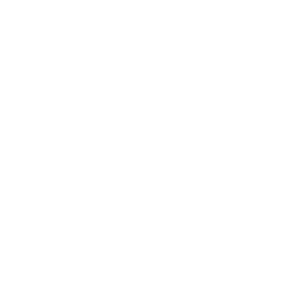
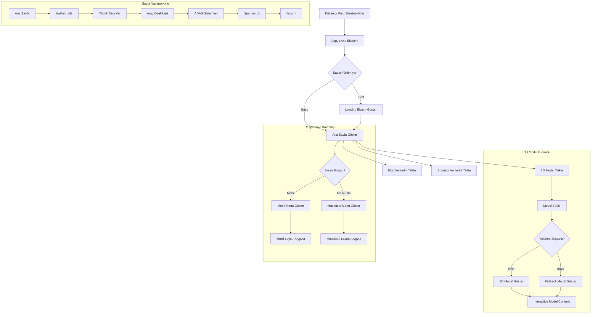

# Voltaris Website

<div align="center">
  
  <h3>İYTE Elektrikli Araç Takımı - Resmi Web Sitesi</h3>
</div>

## 🚀 Proje Hakkında

Bu repo, İzmir Yüksek Teknoloji Enstitüsü Elektrikli Araç Takımı Voltaris'in resmi web sitesinin kaynak kodlarını içerir. Site, React ve modern web teknolojileri kullanılarak geliştirilmiştir.

## 🛠️ Teknolojiler

- **React.js** - Arayüz geliştirme
- **Three.js / React Three Fiber** - 3D modeller ve animasyonlar
- **TailwindCSS** - Stil ve tasarım
- **Lucide-React** - İkonlar

## 📋 Özellikler

- Responsive tasarım
- 3D araç model görüntüleyici
- Ekip yapısı ve istatistikleri
- ADAS sistem görselleştirmesi
- Sponsorluk paketleri
- İletişim formu

## 🏗️ Yapı

```
voltaris-website/
├── public/               # Statik dosyalar
│   ├── models/           # 3D model dosyaları
│   ├── fonts/            # Font dosyaları
│   ├── sponsors/         # Sponsor görselleri
│   └── team/             # Ekip fotoğrafları
├── src/                  # Kaynak kodlar
│   ├── 3D/               # 3D modeller ve bileşenler
│   ├── components/       # React bileşenleri
│   ├── hooks/            # Özel React hooks
│   ├── utils/            # Yardımcı fonksiyonlar
│   ├── team/             # Ekip verileri ve bileşenleri
│   └── App.js            # Ana uygulama bileşeni
└── package.json          # Proje bağımlılıkları
```

## 📊 Proje Akış Diyagramı



## 🚀 Kurulum

1. Repo'yu klonlayın:
```bash
git clone https://github.com/adzetto/voltaris-website-official.git
cd voltaris-website-official
```

2. Bağımlılıkları yükleyin:
```bash
npm install
```

3. Geliştirme sunucusunu başlatın:
```bash
npm start
```

4. Tarayıcıda `http://localhost:3000` adresine gidin.

## 📦 Derleme

Projeyi üretim için derlemek için:

```bash
npm run build
```

## 🚀 Deployment

GitHub Pages üzerinde yayınlamak için:

```bash
npm run deploy
```

## 📝 Notlar

- 3D modeller için `public/models` dizinindeki dosyaları kullanın
- Sponsorluk ve ekip verileri `src/teamData.js` dosyasında yönetilmektedir

## 📄 Lisans

Bu proje MIT lisansı altında lisanslanmıştır. Daha fazla bilgi için `LICENSE` dosyasına bakınız.

## 📞 İletişim

- **E-posta:** voltaris.official@gmail.com
- **Instagram:** [@Voltaris.official](https://www.instagram.com/Voltaris.official/)
- **LinkedIn:** [İYTE Voltaris](https://www.linkedin.com/company/i̇yte-voltaris-teknofest-efficiency-challange/)
