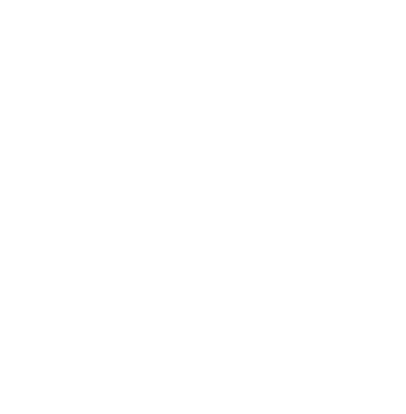
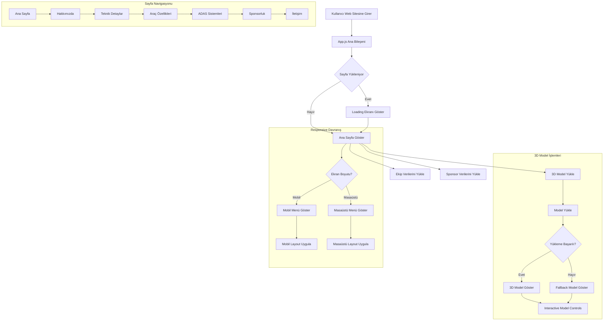

# Voltaris Website

<!-- badges -->
    

   

   


<div align="center">
  
  <h3>İYTE Elektrikli Araç Takımı - Resmi Web Sitesi</h3>
</div>

## 🚀 Proje Hakkında

Bu repo, İzmir Yüksek Teknoloji Enstitüsü Elektrikli Araç Takımı Voltaris'in resmi web sitesinin kaynak kodlarını içerir. Site, React ve modern web teknolojileri kullanılarak geliştirilmiştir.

## 🛠️ Teknolojiler

- **React.js** - Arayüz geliştirme
- **Three.js / React Three Fiber** - 3D modeller ve animasyonlar
- **TailwindCSS** - Stil ve tasarım
- **Lucide-React** - İkonlar

## 📋 Özellikler

- Responsive tasarım
- 3D araç model görüntüleyici
- Ekip yapısı ve istatistikleri
- ADAS sistem görselleştirmesi
- Sponsorluk paketleri
- İletişim formu

## 🏗️ Yapı

```
voltaris-website/
├── public/               # Statik dosyalar
│   ├── models/           # 3D model dosyaları
│   ├── fonts/            # Font dosyaları
│   ├── sponsors/         # Sponsor görselleri
│   └── team/             # Ekip fotoğrafları
├── src/                  # Kaynak kodlar
│   ├── 3D/               # 3D modeller ve bileşenler
│   ├── components/       # React bileşenleri
│   ├── hooks/            # Özel React hooks
│   ├── utils/            # Yardımcı fonksiyonlar
│   ├── team/             # Ekip verileri ve bileşenleri
│   └── App.js            # Ana uygulama bileşeni
└── package.json          # Proje bağımlılıkları
```

## 📊 Proje Akış Diyagramı


```mermaid
graph TD
    A[Kullanıcı Web Sitesine Girer] --> B[App.js Ana Bileşeni]
    B --> C{Sayfa Yükleniyor}
    C -->|Evet| D[Loading Ekranı Göster]
    C -->|Hayır| E[Ana Sayfa Göster]
    D --> E
    E --> F[3D Model Yükle]
    E --> G[Ekip Verilerini Yükle]
    E --> H[Sponsor Verilerini Yükle]
    
    subgraph Sayfa Navigasyonu
    I[Ana Sayfa] --> J[Hakkımızda]
    J --> K[Teknik Detaylar]
    K --> L[Araç Özellikleri]
    L --> M[ADAS Sistemleri]
    M --> N[Sponsorluk]
    N --> O[İletişim]
    end
    
    subgraph 3D Model İşlemleri
    F --> P[Model Yükle]
    P --> Q{Yükleme Başarılı?}
    Q -->|Evet| R[3D Model Göster]
    Q -->|Hayır| S[Fallback Model Göster]
    R --> T[Interactive Model Controls]
    S --> T
    end
    
    subgraph Responsive Davranış
    E --> U{Ekran Boyutu?}
    U -->|Mobil| V[Mobil Menü Göster]
    U -->|Masaüstü| W[Masaüstü Menü Göster]
    V --> X[Mobil Layout Uygula]
    W --> Y[Masaüstü Layout Uygula]
    end
```

## 🚀 Kurulum

1. Repo'yu klonlayın:
```bash
git clone https://github.com/adzetto/voltaris-website-official.git
cd voltaris-website-official
```

2. Bağımlılıkları yükleyin:
```bash
npm install
```

3. Geliştirme sunucusunu başlatın:
```bash
npm start
```

4. Tarayıcıda `http://localhost:3000` adresine gidin.

## 📦 Derleme

Projeyi üretim için derlemek için:

```bash
npm run build
```

## 🚀 Deployment

GitHub Pages üzerinde yayınlamak için:

```bash
npm run deploy
```

## 📝 Notlar

- 3D modeller için `public/models` dizinindeki dosyaları kullanın
- Sponsorluk ve ekip verileri `src/teamData.js` dosyasında yönetilmektedir

## 📄 Lisans

Bu proje MIT lisansı altında lisanslanmıştır. Daha fazla bilgi için `LICENSE` dosyasına bakınız.

## 📞 İletişim

- **E-posta:** voltaris.official@gmail.com
- **Instagram:** [@Voltaris.official](https://www.instagram.com/Voltaris.official/)
- **LinkedIn:** [İYTE Voltaris](https://www.linkedin.com/company/i̇yte-voltaris-teknofest-efficiency-challange/)
